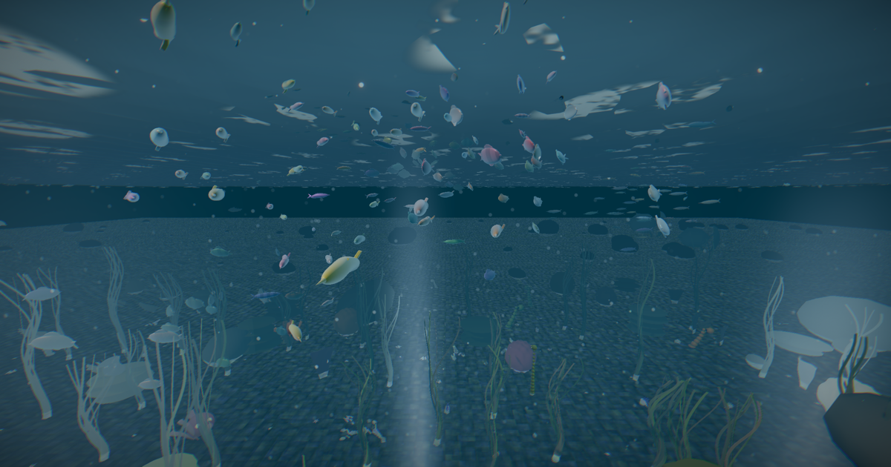

# Ocean Ecosystem Simulator

A **cinematic** real-time underwater ecosystem built with Three.js and bitECS — a moody deep-water world of hundreds of living marine creatures, volumetric god rays, and emergent schooling behaviour, running in the browser.



> **Hero flythrough:** an 18-second in-engine cinematic dive lives at [`public/hero.mp4`](public/hero.mp4) — surface → through the light shafts and a passing school → over the reef.

## Cinematic Deep — the visual overhaul

The engine was strong but the art direction read flat ("swimming pool"). A ground-up
**Cinematic Deep** pass rebuilt the look. Highlights of the technique:

- **Per-channel Beer-Lambert depth grading** — red is absorbed fastest, cyan persists, so
  distance dissolves into deep-water murk. This single change is what reads as *ocean* rather
  than *pool*. (`PostProcessingPipeline` underwater grading + `WavelengthLighting` fog.)
- **Volumetric god-ray shafts** — soft additive billboard columns that descend from the
  surface and shimmer in sync with the caustics. The hero effect. (`VolumetricLightShafts`.)
- **Believable fish** — fixed an over-amplitude swim wave (bodies were crescenting into
  boomerangs) and a normals bug that forced flat faceting; added a fresnel rim light,
  iridescence and countershading. (`SimpleFishGeometry`, `BatchedMeshPool`.)
- **Cohesive schools** — thinned and tightened the shoals so the frame has negative space
  instead of confetti. (`OceanSimulator.spawnInitialFish`, FIRA steering.)
- **Filmic post** — AgX tonemapping (preserves teal better than ACES), subtle film grain,
  chromatic aberration, vignette. (`PostProcessingPipeline`.)
- **Art-directed look presets** — a single `Cinematic Deep` / `Clean` switch drives every
  light, fog, exposure and post parameter. (`OceanSimulator.applyLookPreset`.)

## Features

### Marine Life
- **500+ Creatures**: Fish schools, sharks, dolphins, jellyfish, rays, turtles, whales
- **Bottom Dwellers**: Crabs, starfish, sea urchins
- **Environment**: Kelp forests, coral formations, sea anemones

### Rendering
- **FFT Ocean Surface**: Realistic wave simulation with foam and spray
- **Underwater Lighting**: Beer-Lambert light absorption, caustics, god rays
- **Post-Processing**: Bloom, chromatic aberration, color grading, vignette
- **Instanced Rendering**: GPU-optimized for hundreds of fish

### Simulation
- **FIRA Steering**: Fish Intelligent Responsive Algorithm for realistic movement
- **Hunting System**: Predator-prey dynamics with sustainable population balance
- **Schooling Behavior**: Based on Reynolds' boids algorithm
- **Ocean Currents**: Dynamic water flow affecting creature movement

## Quick Start

```bash
npm install
npm run dev
```

Open `http://localhost:5173`

## Controls

| Action | Control |
|--------|---------|
| Move | WASD |
| Up/Down | Q/E |
| Look | Mouse |
| Toggle UI | H |
| Pause | Button in UI |

## Tech Stack

| Component | Technology |
|-----------|------------|
| Rendering | Three.js |
| ECS | bitECS |
| Post-Processing | postprocessing |
| Build | Vite + TypeScript |

## Project Structure

```
src/
  components/     # ECS components (Transform, Biology, Behavior)
  core/           # World setup, entity factory
  creatures/      # Procedural geometry (fish, sharks, whales, etc.)
  rendering/      # Visual systems (ocean, lighting, particles)
  systems/        # ECS systems (movement, hunting, population)
  shaders/        # GLSL shaders
```

## License

MIT
